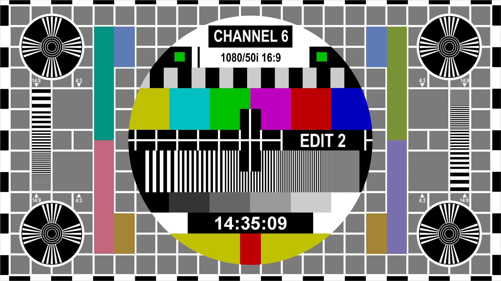

# MJPEG stream demo server by Reactor netty
[https://github.com/saladlam/netty-mjpeg-demo-server](https://github.com/saladlam/netty-mjpeg-demo-server)



## Introduction
A motion JPEG stream http server which is made by using Project Reactor framework.

## Main component used
- Project Reactor Core 3.6.X
- Reactor netty 1.1.X
- netty 4.1.X

## Prerequisite
- Java SE Development Kit 17 or above
- Internet connection
- Common internet browser

## Compile and run
Apache Maven wrapper is included, no addition package manager is necessary.

### Compile (On Microsoft Windows)
```
mvnw package
```

### Run (On Microsoft Windows)
```
java -jar target\netty-mjpeg-demo-server-0.1.jar
```

## Endpoint
This server is bind on TCP port 8080 of all interface.

```
# To get a single frame
http://localhost:8080/mjpg/frame.jpg

# To get a video stream in 5Hz
http://localhost:8080/mjpg/video.mjpg
```

## Problem
1. Frame generation cannot faster than 13Hz.
1. Don't know why there is a constant read/write operation (around 1.5 MB/s) to hard disk when server started.
1. Memory used of server increases quickly if a slow connection is established.

## Acknowledgement
The background test card is downloaded from [http://www.channel6.dk/mainsite/EN/Page421.html](http://www.channel6.dk/mainsite/EN/Page421.html).
